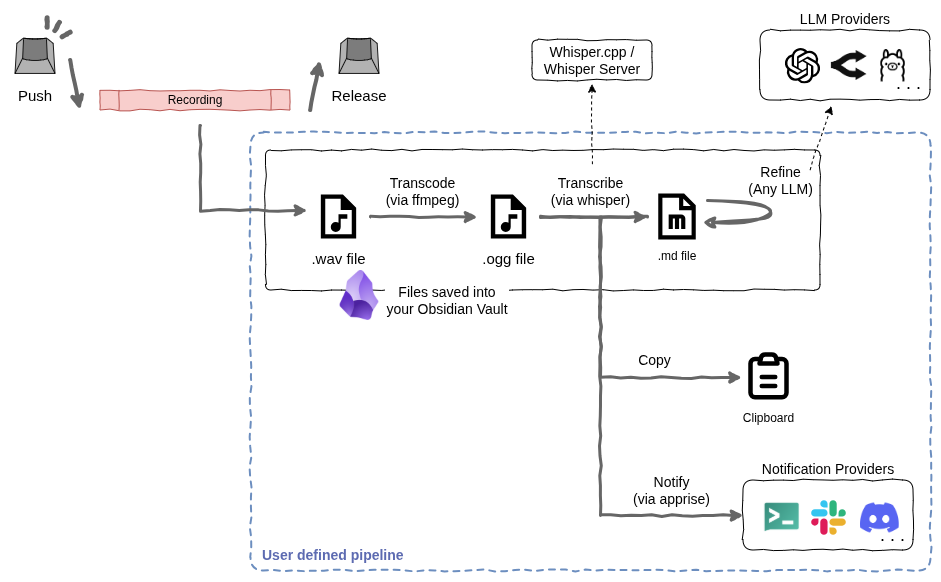

# push-to-whisper

A smart voice memo tool aka **`push-to-stt-to-md-to-llm-to-clipboard-or-whatever`.**



### What you can do with push-to-whisper:

- **Record** audio while holding a global key combination.
- **Save** the recording as a `.wav` file (e.g., directly into your Obsidian vault).
- **Transcode** it into `.ogg` or other formats for efficiency (via ffmpeg).
- **Transcribe** it into Markdown using Whisper (Currently supports `whisper.cpp` server).
- **Refine** the text using LLM APIs like OpenAI, Gemini, or Ollama (via any-llm).
  - Auto tagging, auto summarization, etc.
- **Copy** the result to your clipboard automatically.
- **Notify** success or send results to notification services like Slack, Discord, or Ntfy (via Apprise).

Every step above is modular. You can combine them to build your own custom workflow in a simple YAML configuration file.

## Installation

1. Install system dependencies:
   ```bash
   # Debian/Ubuntu
   sudo apt install libgirepository1.0-dev libcairo2-dev python3-dev ffmpeg
   ```

2. Install the package using `uv`:
   ```bash
   uv tool install push-to-whisper
   ```

3. Install the systemd user service and generate a default config:
   ```bash
   push-to-whisper install-daemon
   ```

## Configuration

The configuration file is located at `~/.config/push-to-whisper/config.yaml`. You can customize the Whisper endpoint, LLM API keys (any-llm), and processing pipelines.

To re-initialize or export the default configuration:
```bash
push-to-whisper init --bare -o ~/.config/push-to-whisper/config.yaml
```

## Usage

Once the daemon is installed via `install-daemon`, it will start automatically on login.

### Default Shortcuts

On Linux (KDE/GNOME), shortcuts are managed by the system. After running `install-daemon`, you can assign keys to the following actions in your system settings:

- **Transcription to Markdown**: (Recommended: `ALT+SHIFT+x`) - Transcribe -> Transcode -> Save Audio -> Save Markdown -> Notify.
- **Transcription to Clipboard**: (Recommended: `ALT+SHIFT+c`) - Transcribe -> Transcode -> Copy to Clipboard -> Notify.

*Note: Currently tested and supported only on Linux (Fedora) with KDE Plasma (Wayland). Native support for Windows and macOS is planned for future releases.*

## Development

- **Formatting**: `uv run ruff format .`
- **Linting**: `uv run ruff check . --fix`
- **Testing**: `uv run pytest`

## License

MIT
